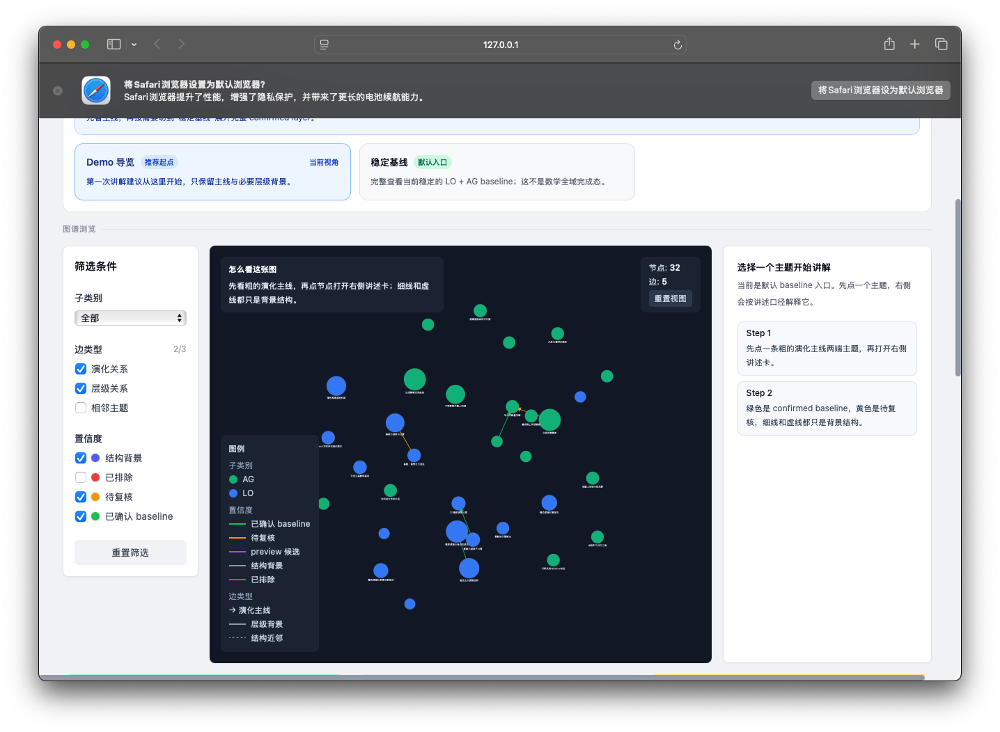

# Academic Evolution Graph

一个面向数学研究主题演化的静态知识图谱项目。

它要解决的不是“最近什么方向更热”，而是一个更难也更长期的问题：

**一个数学子域内部的研究主题，究竟是怎样沿着时间演化出来的？**



## 我们为什么要做这件事

传统的热点分析通常只能回答：

- 哪些关键词更常一起出现
- 哪些主题在某个月更热
- 哪些方向最近论文变多了

但这些信息还不够回答真正重要的问题：

- 某条研究线是在对象层连续，还是只是在方法层相似
- 一个 topic 是真的演化成了另一个 topic，还是只是暂时相邻
- 一个新方向是已有主线的延展，还是跨子域桥接出来的支路
- 哪些关系已经足够稳定，哪些仍然只是候选或近似

这个项目就是为了把这些问题从“叙述性的判断”，推进到“可以复查的结构化知识”。

我们最终想做的，不是一组更好看的图，而是一个：

**数学历史主题演化知识图谱**

## 这个图谱是怎么构建的

整个方法可以理解成四层。

### 1. 先把不同时间片的 topic 对齐

我们先把不同月份的局部 topic 对齐成全局 topic，得到：

- 同一研究线在不同月份的历史轨迹
- topic 在层级结构中的位置
- 多期活跃 history

这是后续一切演化判断的基础。

### 2. 不只看“有哪些 topic”，而是看“它们怎么变”

我们关心的不只是一个 topic 是否存在，更关心：

- 它和哪些 topic 相邻
- 它是否沿某条主线延续
- 它是不是桥接到别的研究支路
- 它的对象和方法有没有发生迁移

这部分通过 topic graph、演化 case 和 case detail 来表达。

### 3. 给关系分证据层级

这个项目最核心的设计之一，是**不把所有边都当成同一种 truth**。

我们会区分：

- `confirmed`
  - 已经有 benchmark 或人工 review 支撑
- `bridge`
  - 有结构或语义支持，但还不到 event-level
- `boundary`
  - 用来说明“看起来相近，但不应被算成演化”
- `review`
  - 当前仍需人工复核
- `preview`
  - 只作为研究候选，不进入默认 baseline

这一步的意义是：

**把图变成知识图谱，而不是一张不区分强弱的连线图。**

### 4. 用 benchmark 约束我们自己

我们不会因为一条边“看起来很像”就把它写成事实。

benchmark 迫使我们持续回答：

- 这是 event-level 还是 bridge-level
- 这是 object continuity 还是 method overlap
- 这是 confirmed case 还是 near-miss

从方法上说，benchmark 是这套系统的刹车和校准器。

## 当前构建路径

当前这张图不是从“全数学一口气做完”开始的，而是先做少数可闭环子域，再逐步扩展。

到目前为止，我们的推进顺序大致是：

1. 先把 `math.LO` 做成稳定 baseline
2. 再把 `math.AG` 做成稳定 baseline
3. 对 `math.PR` 做深入 review，最后明确它只适合 preview，不应进入默认 baseline
4. 新增 `math.CO`、`math.DS`、`math.NA` 的 benchmark / rule / metadata 层
5. 把这些新增子域逐步接到知识图谱 exporter 和前端 narrative 层

这意味着当前图谱不是“数学全域完成态”，而是一个**可信核心 + 逐步扩展的外圈结构**。

## 当前进度

### 已经是默认主图的一部分

- `math.LO`
  - 当前最稳定的 baseline 子域之一
- `math.AG`
  - 当前最稳定的 baseline 子域之一

这两条线构成了默认知识图谱的 confirmed core。

### 已经整理出来，但还没有升格成默认主图 truth

- `math.CO`
  - 已经有第一条保守 MVP 规则
  - 目前更适合以 contract / bridge / boundary 方式展示
- `math.DS`
  - 已经有 conservative MVP
  - 当前更接近 graph-visible but non-baseline
- `math.NA`
  - 已经有 skeleton 和明确方向
  - 还在继续向“可上图”推进

### 当前明确不进入默认主图

- `math.PR`
  - 只保留在 preview 路径
- `math.QA`
  - 当前是 gap / excluded
- `math.RA`
  - 当前是 gap / excluded

## 这张图现在怎么读

默认页面里，最重要的是区分三件事：

1. **baseline 主线**
   - 这是当前最稳定、最适合公开讲述的演化关系
2. **bridge / boundary / review 层**
   - 这些帮助解释主线为什么成立、为什么没被误扩张
3. **preview / narrative 扩展层**
   - 这些是已经整理出来、但还没进入默认 truth 的部分

所以当你看到图变厚，不一定意味着“新增了一批 confirmed 主线”；
很多时候，它表示的是：

- 我们对外围支路的理解更清楚了
- 图谱的边界更清楚了
- 研究中的候选层开始被结构化表达了

## 这个项目当前最有价值的地方

我认为它现在最有价值的，不只是前端已经能展示一个数学知识图谱，而是：

- 它开始能明确区分“已确认”与“仅候选”
- 它开始能把负例和边界也保留下来
- 它不再只是在做热点图，而是在累积一种可扩展的研究演化表示方法

如果这条路继续走下去，后面能做的就不只是：

- “哪条线更热”

而是：

- 一条研究主线是如何生长出来的
- 哪些支路是真扩展，哪些只是相邻
- 哪些新子域已经接近成熟，哪些还只是研究草图

## 本地运行

如果你只是想本地看图：

```bash
make frontend-install
make deploy
cd frontend && npm run preview
```

如果你要重生知识图谱 bundle：

```bash
make kg-export
make kg-visualization
make deploy
```

## 备注

- 这是一个静态部署项目，没有运行时后端
- 当前默认以 GitHub Pages 发布
- 本仓库是从 `academic-trend-monitor` 独立出来的演化分析主仓，后续会继续以知识图谱为中心演进
